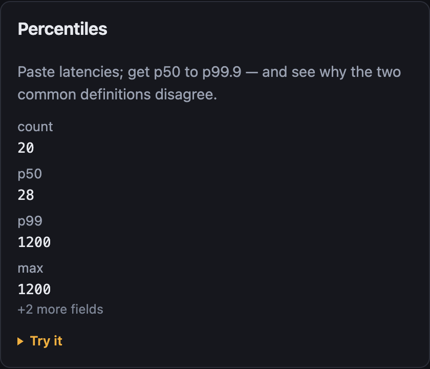
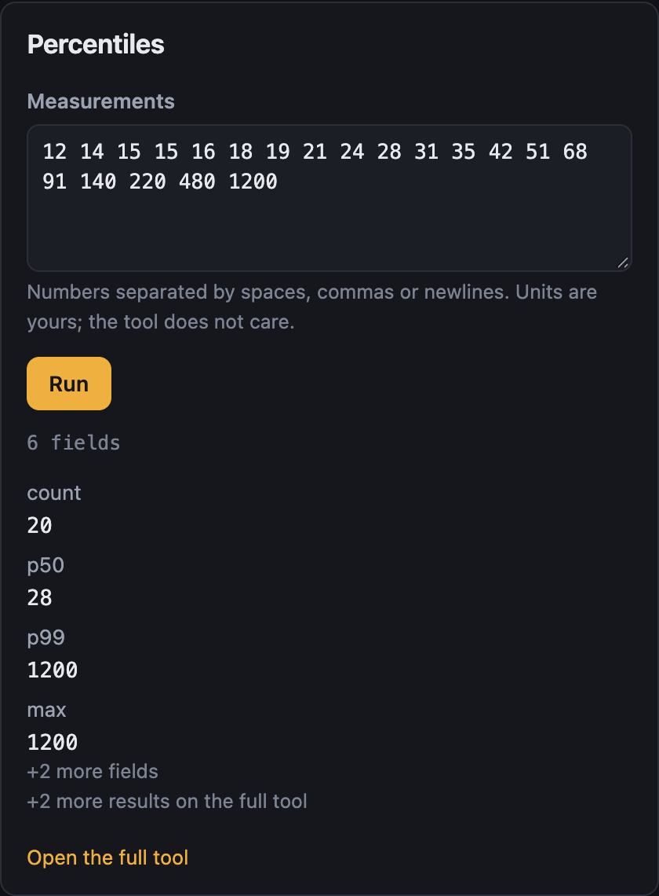
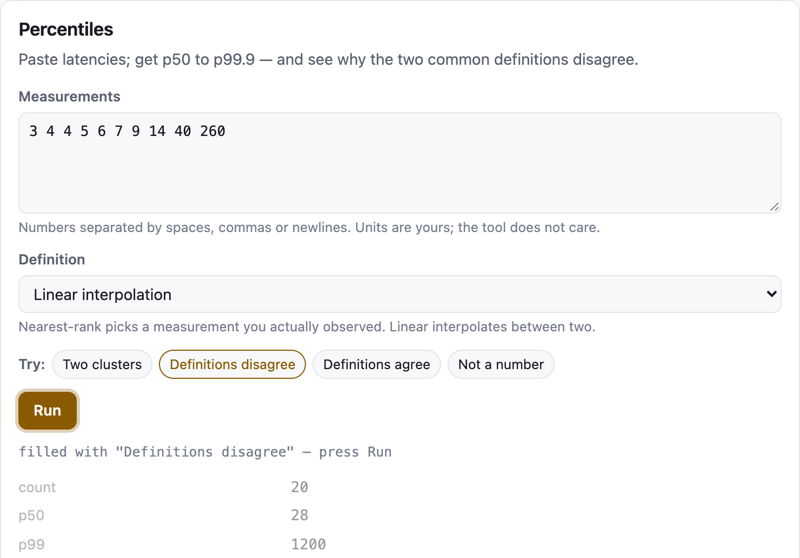
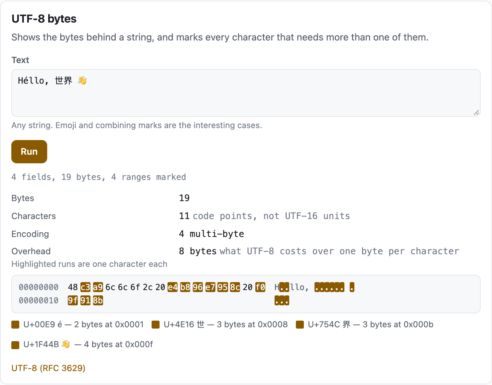
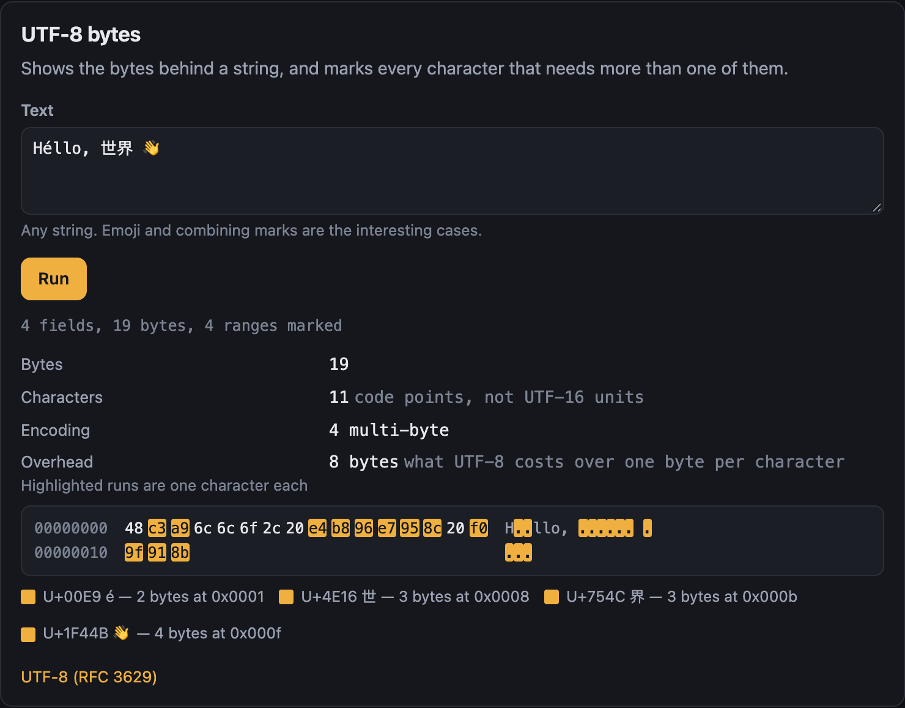
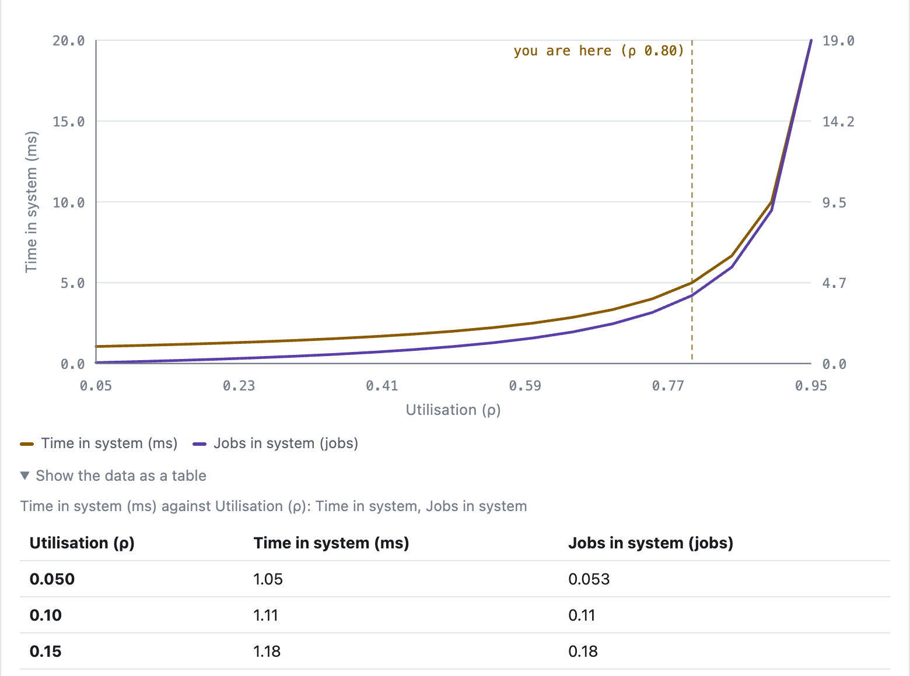
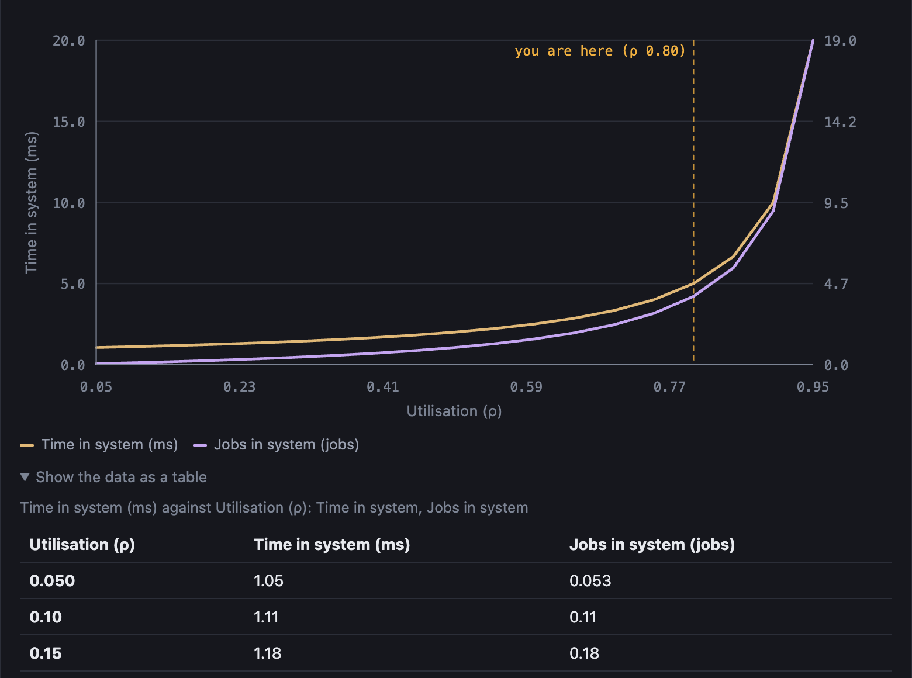

<div align="center">

<picture>
  <source media="(prefers-color-scheme: dark)" srcset="assets/logo-dark.svg">
  
</picture>

# Toolbench

**Ship small interactive tools on a website.**
A tool is one function and one JSON file. Toolbench builds the form, runs it, and renders the result.

<!-- ⚠️ All badges in a group must sit on ONE source line. GitHub renders a single newline as <br>, so
     one badge per line stacks them vertically instead of flowing them inline. -->

[](https://github.com/eknowledger/toolbench/actions/workflows/tests.yml) [](https://github.com/eknowledger/toolbench/actions/workflows/build.yml) [](https://www.npmjs.com/package/@toolbench/runtime) [](LICENSE)

[](docs/versioning.md) [](#size-and-cost) [](#install) [](packages/sdk/src/types.ts) [](#browser-and-runtime-support) [](CONTRIBUTING.md)

</div>

```ts
// tools/reverse/index.ts
import type { Tool } from "@toolbench/sdk";

export default {
  run({ text }) {
    return { kind: "fields", fields: [{ label: "reversed", value: [...text].reverse().join("") }] };
  },
} satisfies Tool<{ text: string }>;
```

```html
<tool-host tool="reverse" mode="card"></tool-host>
```

The tool has no idea it is on the web. The website needs no framework.

## Contents

- [What it looks like](#what-it-looks-like)
- [Why](#why)
- [Install](#install)
- [Quick start](#quick-start)
- [Display modes](#display-modes)
- [How a tool runs](#how-a-tool-runs)
- [Result shapes](#result-shapes)
- [Worker mode](#worker-mode)
- [Theming](#theming)
- [Size and cost](#size-and-cost)
- [Browser and runtime support](#browser-and-runtime-support)
- [Non-goals](#non-goals)
- [Repository layout](#repository-layout)
- [Documentation](#documentation)

## What it looks like

Every screenshot below is the test bench in `bench/`, which is the same runtime a host installs. Nothing
is mocked up.

### A card costs nothing until someone opens it

On the left the card is **static markup**: a result computed at build time by `seed()`, with not one byte
of the tool's code downloaded. On the right, the same card after one click.

<table>
<tr>
<td width="50%"></td>
<td width="50%"></td>
</tr>
<tr>
<td align="center"><em>Closed: markup only, 0 bytes of tool code</em></td>
<td align="center"><em>Opened: one chunk fetched, form generated from the manifest</em></td>
</tr>
</table>

### A tool ships its own examples

`samples` in the manifest becomes a row under the form. A click fills the inputs and stops there, because
Run is the trigger and a sample is an input change like any other: the answer already on screen dims to
say it belongs to the inputs that produced it, rather than being quietly replaced. Below, one click has
loaded ten measurements and switched the definition, and the figures underneath are still the previous
run's.

The one worth shipping is the example whose input the tool rejects. It is the one a reader will never type,
because nobody sits down to invent a broken input, and it is how a tool shows its failure path on purpose
rather than at the least convenient moment.

<table>
<tr>
<td></td>
</tr>
<tr>
<td align="center"><em>One click fills the form. The stale result stays put, so the old answer is still there to compare against</em></td>
</tr>
</table>

### Results are typed shapes, not HTML

A tool returns one of a closed set of shapes and the runtime draws it. Below is `bytes`, for wire
formats: offsets, hex, a printable gutter, and named ranges. The highlight on the four-byte character
**spans the row break**, which is what a table cannot do and why the kind exists.

The same tool in both themes. A tool inherits the page it is on; theming is a dozen CSS custom
properties and nothing else.

<table>
<tr>
<td width="50%"></td>
<td width="50%"></td>
</tr>
</table>

### A chart also ships its numbers

A chart is an image, and a screen reader gets nothing from an image. So every `series` result renders the
same data as a table inside a `<details>`, automatically. The tool author does nothing to get this.

<table>
<tr>
<td width="50%"></td>
<td width="50%"></td>
</tr>
</table>

## Why

Interactive widgets on a website are usually one-offs: a script per widget, wired into one page by
hand. The second widget repeats the form handling, the error states, the loading behaviour and the
styling. By the fourth they have drifted apart, and none of them has tests.

Toolbench turns the shape of a tool into a contract. In exchange:

* **Fixtures are the test suite.** A tool ships known-answer cases that run in Node, with no browser
  and no build step. A broken tool fails your build instead of someone's afternoon.
* **One interface for every tool**, accessible by default: real labels, errors tied to the input that
  caused them, a status region, keyboard operation, reduced-motion support.
* **Nothing loads until it is needed.** A card downloads no tool code until someone opens it.
* **Old tools keep working.** The contract is versioned, changes are additive only, and compatibility
  is enforced by tests rather than intent. See [docs/versioning.md](docs/versioning.md).

## Install

```sh
pnpm add @toolbench/sdk @toolbench/runtime
```

`@toolbench/sdk` is what tool authors import. It has no dependencies and does not touch the DOM.
`@toolbench/runtime` is what the website imports. It has no dependencies either, and no framework.

## Quick start

Three steps. The result is a working tool page.

**1. Write the tool.** Four files in a directory:

```
tools/reverse/
  tool.json      identity, inputs, result shapes
  index.ts       the function
  cases.json     known-answer fixtures
  README.md      help text
```

```jsonc
// tools/reverse/tool.json
{
  "sdk": 1,
  "id": "reverse",
  "name": "Reverse text",
  "blurb": "Reverses a string. Handles emoji correctly, which is most of the interest.",
  "version": "1.0.0",
  "capabilities": ["pure"],
  "runtime": { "entry": "index.ts", "thread": "main" },
  "kinds": ["fields", "error"],
  "card": "live",
  "inputs": [
    { "id": "text", "type": "text", "label": "Text", "primary": true, "default": "hello" }
  ]
}
```

**2. Register it.** Once per site:

```ts
import { defineToolHost, RegistrySource } from "@toolbench/runtime";
import manifest from "./tools/reverse/tool.json";

defineToolHost({
  source: new RegistrySource({
    reverse: { manifest, load: () => import("./tools/reverse/index.ts") },
  }),
  pageUrl: (id) => `/tools/${id}/`,
});
```

With a bundler that supports directory globs, the source is a loop over the glob instead of a literal
map. [`bench/src/registry.ts`](bench/src/registry.ts) is the version this repository uses, and it
picks up new tools with no code change.

**3. Put it on a page.**

```html
<tool-host tool="reverse" mode="page"></tool-host>
```

**4. Test it.** `cases.json` holds inputs and expected results:

```jsonc
[
  {
    "name": "reverses a string",
    "input": { "text": "abc" },
    "expect": { "kind": "fields", "fields": [{ "label": "reversed", "value": "cba" }] }
  }
]
```

```sh
node --test tools/cases.test.ts
```

On your own site that suite is three lines, since the directory walk is exported:

```ts
import { describe, it } from "node:test";
import { checkToolDirectory } from "@toolbench/sdk/fixtures";

checkToolDirectory(new URL("../src/tools/", import.meta.url), { describe, it });
```

It validates every manifest, checks each tool's `id` matches its directory, refuses an empty
`cases.json`, verifies no case expects a kind the manifest failed to declare, runs every case, and runs
every sample the manifest declares. Wire it into CI and a change that breaks a tool fails your build
instead of someone's afternoon.

Full walkthrough: [docs/authoring-a-tool.md](docs/authoring-a-tool.md).

## Display modes

One declaration drives three presentations. The mode also decides when the tool's code is fetched,
which is the difference between a page that stays fast and one that does not.

| `mode` | Shows | Fetches the tool's code |
|---|---|---|
| `card` | Name, blurb, the input marked `primary`, the first few result fields | When the reader opens it. Until then the card is static markup. |
| `page` | Every input, the full result, the tool's links | When it scrolls within two viewports |
| `embed` | Same as `page` without the title, sized for the middle of an article | When it scrolls within two viewports |

A card is a facade: markup with no behaviour and no download. If your site renders HTML ahead of time,
give the card a **seed**: the tool's result for its default inputs, computed during your build. The card
then shows a real result with no JavaScript at all.

Compute it with `seed()` rather than writing it by hand. A hand-written seed is correct on the day it is
typed and drifts silently afterwards, showing a confidently wrong answer to every reader who does not
press Run. That is not hypothetical: the seed in this repository's own bench was hardcoded and had drifted
by the time `seed()` replaced it.

```ts
// In your build: a Vite plugin, an Astro integration, a script that writes HTML.
import { seed, serialiseSeed } from "@toolbench/sdk";

const output = await seed({ manifest, tool });
// A card renders only the first part of a group, so there is no point shipping the rest.
const forCard = output.kind === "group" ? output.parts[0] : output;

html = `<tool-host tool="percentiles" mode="card">
  <script type="application/json" data-toolbench-seed>${serialiseSeed(forCard)}</script>
</tool-host>`;
```

⚠️ Use `serialiseSeed`, not `JSON.stringify`. An HTML parser ends a `<script>` at the first `</script` in
its text however the JSON is quoted, so a tool that echoes any part of its input could otherwise truncate
your page. [`bench/vite.config.ts`](bench/vite.config.ts) is a working 30-line version of the above.

`seed()` **throws** if a tool crashes on its own defaults or rejects them, because both are authoring bugs
and a card seeded with an error is worse than an unseeded one. Wrap it if you would rather have a missing
seed than a failed build.

## How a tool runs

The reader decides. Nothing runs on its own.

* Opening a card, or scrolling a tool into view, loads its code and shows the form. It does not run
  the tool.
* **Run** runs it. So does <kbd>Enter</kbd> in a single-line input, or <kbd>Ctrl</kbd>/<kbd>Cmd</kbd> +
  <kbd>Enter</kbd> in a textarea.
* Changing an input marks the current result stale: it dims, and the status line says so. The previous
  result stays on screen because it is still the last true one, and keeping it is what lets you compare
  before and after.
* A tool that is genuinely instant can set `"autoRun": true` and update as the reader types. It is off
  by default, and the validator rejects it for worker-mode tools.

The progress bar appears only if a run is still going after 400 ms. A bar that flashes for 20 ms draws
the eye to report that nothing happened.

**A tool can ship its own examples.** `samples` is a list of labelled inputs, which the runtime draws as
a row of buttons under the form:

```jsonc
"samples": [
  { "label": "Definitions disagree", "input": { "values": "3 4 4 5 6 7 9 14 40 260", "method": "linear" } },
  { "label": "Not a number", "input": { "values": "12, 14, 15, 18ms, 21, 24, 31, 44" } }
]
```

Clicking one fills the form, which is an input change like any other: the result goes stale and waits for
Run, or re-runs if the tool set `autoRun`. Each `input` is partial, so a sample changes the one thing it is
about and leaves the rest as the reader left it. The sample most worth shipping is the one the tool
rejects, because nobody types a broken input by hand, and it is the only way a reader sees the failure path
before meeting it for real. Cards show no samples: there is room there for one input and a Run button.
Added in contract version 3, and
[docs/authoring-a-tool.md](docs/authoring-a-tool.md#4b-sample-inputs) covers choosing them.

## Result shapes

A tool returns one of a closed set of shapes, so the runtime can draw anything a tool produces and a
tool cannot invent something nobody can render.

| Kind | Use for |
|---|---|
| `fields` | Label and value pairs, optionally grouped under headings |
| `table` | Columns and rows, with alignment and per-cell emphasis |
| `series` | A chart with axes, legend and annotations. Ships the same numbers as a table for readers who cannot see it |
| `text` | Prose or preformatted output |
| `code` | Source, with a language tag the host can highlight |
| `bytes` | Raw bytes as a reader of a wire format wants them: offsets, hex, a printable gutter, and named ranges that can wrap a row |
| `group` | Several of the above in one result. A decoder that returns fields *and* a table is the common case |
| `error` | The input was wrong. Naming the input marks that control invalid and attaches the message to it |

Returning `error` means the input was bad and the tool worked. Throwing means the tool has a bug. The
two render differently on purpose.

## Worker mode

A tool whose running time depends on its input sets `"thread": "worker"`. That is the only mode where a
timeout can stop a run, because on the main thread there is nothing to terminate.

The host then needs one file, and it has to live in the host project because only the host's bundler
can resolve the host's tools:

```ts
// tool.worker.ts
import { createToolWorker } from "@toolbench/runtime/worker";
import { registry } from "./registry.ts";

createToolWorker({ load: (id) => registry[id].load() });
```

```ts
defineToolHost({
  source,
  workerFactory: () => new Worker(new URL("./tool.worker.ts", import.meta.url), { type: "module" }),
});
```

Two things to know before you spend an afternoon on them:

* **Vite defaults `worker.format` to `"iife"`**, which cannot code-split. A worker that imports tools
  builds in development and fails the production build. Set `worker: { format: "es" }`.
* If no `workerFactory` is configured, a worker-mode tool runs on the main thread and logs a warning.
  A slow tool is better than a missing one.

## Theming

The runtime renders inside a shadow root. Your CSS cannot reach in and break a tool, and the tool's CSS
cannot leak out and break your page. Theming is therefore a list of custom properties, and that list is
the whole styling API:

```css
tool-host {
  --tb-accent: #0b6b5f;
  --tb-bg: #ffffff;
  --tb-surface: #f4fbf9;
  --tb-border: #b9dbd4;
  --tb-radius: 2px;
  --tb-font: Georgia, serif;
  --tb-mono: "SF Mono", monospace;
}
```

Defaults use `light-dark()`, so a tool follows the page's colour scheme before anyone configures
anything. The full list is at the top of
[`packages/runtime/src/styles.ts`](packages/runtime/src/styles.ts).

## Size and cost

Measured on the built bench with gzip, not estimated:

| | Transfer |
|---|---|
| Runtime plus the bench's page wiring, once per page that uses a tool | 18.9 KB |
| Worker entry, only for pages with a worker-mode tool | 3.3 KB |
| `percentiles` tool chunk | 1.2 KB |
| `queue-explorer` tool chunk | 1.2 KB |
| A page with no tool on it | 0 bytes |
| A card nobody opens | 0 bytes of tool code |

Reproduce with `pnpm bench:build && node scripts/size-check.mjs`. CI runs the same check against a
budget, so these numbers cannot rot.

## Browser and runtime support

In the browser the runtime needs custom elements, shadow DOM, `IntersectionObserver`, module workers
and CSS container queries: Chrome 105+, Firefox 114+, Safari 16.4+.

Two newer features are used with plain fallbacks in front of them, so a browser without either gets
light colours rather than a broken layout: `light-dark()` for automatic dark mode (Chrome 123+,
Firefox 120+, Safari 17.5+) and `color-mix()` for one focus ring. Anything older than the baseline
above shows the static facade and its seeded result, which is one reason seeding is worth doing.

Development and tests: Node 24 or newer. Toolbench runs TypeScript directly, which is how fixtures
execute with no build step. Any bundler for the host site; the examples use Vite 7.

## Non-goals

* **Not a code playground.** Readers do not write code here. That needs a compiler in the browser,
  which is megabytes.
* **Not a notebook.** No dataflow between tools, no execution order.
* **Not a sandbox.** A tool is code you wrote and bundled. Worker mode is a stability boundary that
  lets a slow run be stopped; it is not a security boundary, and the docs never pretend otherwise. Code
  you did not write needs a different design.
* **The contract is pure functions only.** No file input, no network access, at contract version 3.
  Both are planned as additive versions, which is the case the versioning policy exists to handle.

## Repository layout

| Path | What it is |
|---|---|
| `packages/sdk` | The contract: types, manifest validation, version migration, fixture runner. No dependencies, no DOM. |
| `packages/runtime` | `<tool-host>`: the element, the form, the renderers, the runner, the worker protocol. |
| `tools/` | Two example tools, with fixtures and help. |
| `bench/` | The test bench: three display modes, both threading modes, host theming, and a tool that fails on purpose. |
| `docs/` | Architecture, authoring, versioning. |

```sh
pnpm install
pnpm check          # typecheck, unit tests, every tool's fixtures
pnpm bench          # the bench on http://localhost:5180
pnpm test:bench     # the same bench, driven by Chrome
```

## Documentation

| Document | For |
|---|---|
| [docs/architecture.md](docs/architecture.md) | How it works, where the boundaries are, how to change it, how to contribute |
| [docs/authoring-a-tool.md](docs/authoring-a-tool.md) | Writing, testing and shipping a tool |
| [docs/versioning.md](docs/versioning.md) | The compatibility policy and how to raise the contract version |
| [docs/releasing.md](docs/releasing.md) | How versions are decided and how a release reaches npm |
| [CONTRIBUTING.md](CONTRIBUTING.md) | Setup, the loop, and which opinions are load bearing |
| [SECURITY.md](SECURITY.md) | The threat model, and what is in scope to report |
| [ROADMAP.md](ROADMAP.md) | What is planned, in what order, and why that order |

## Licence

[MIT](LICENSE).
