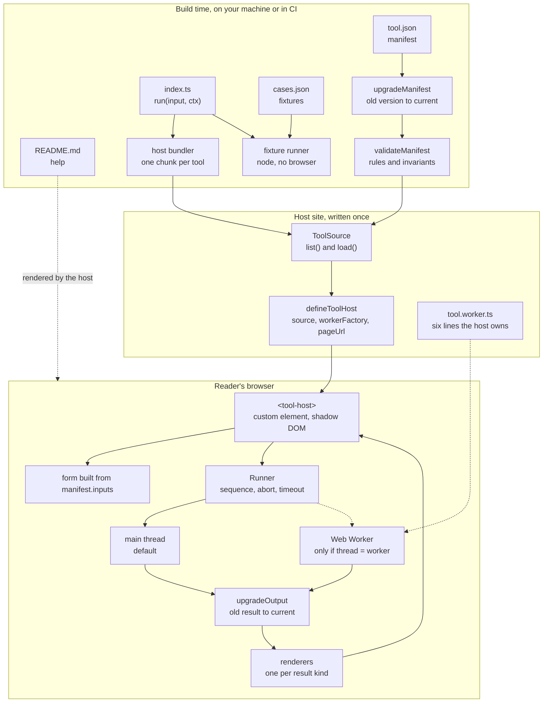
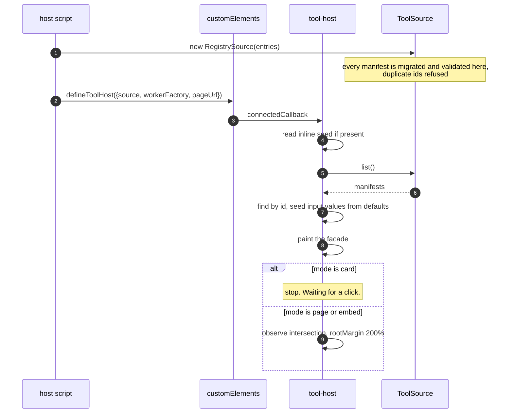
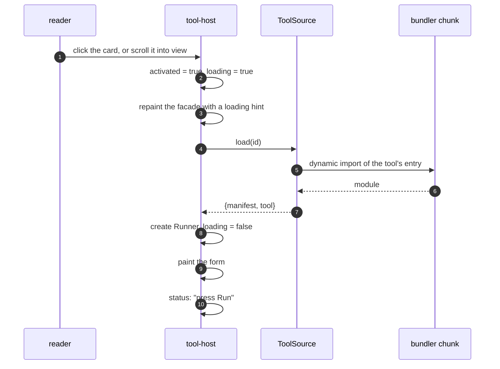
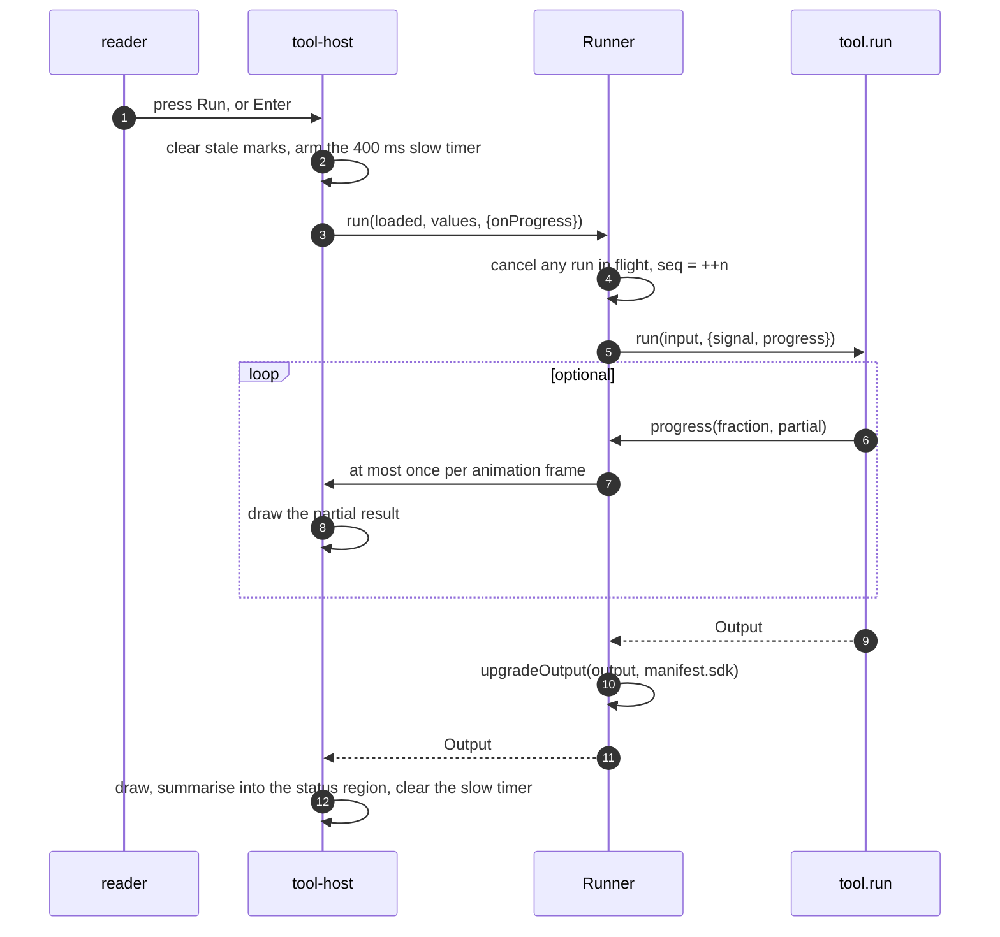
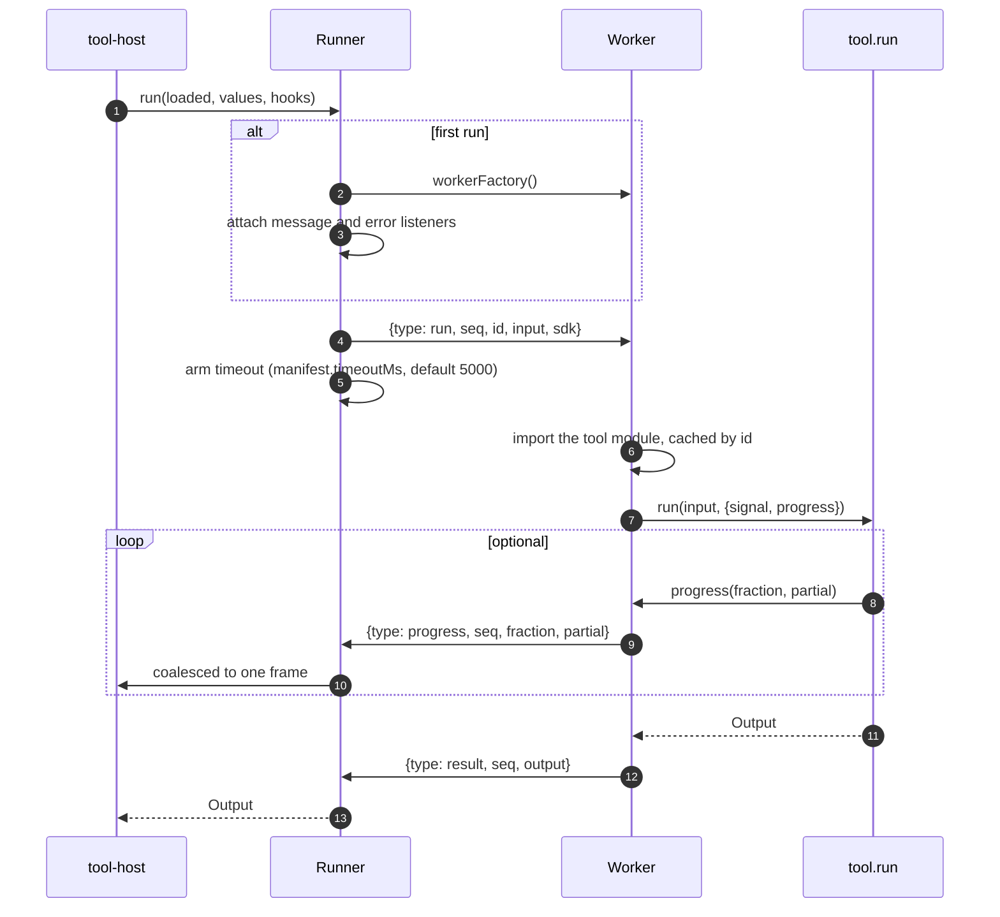
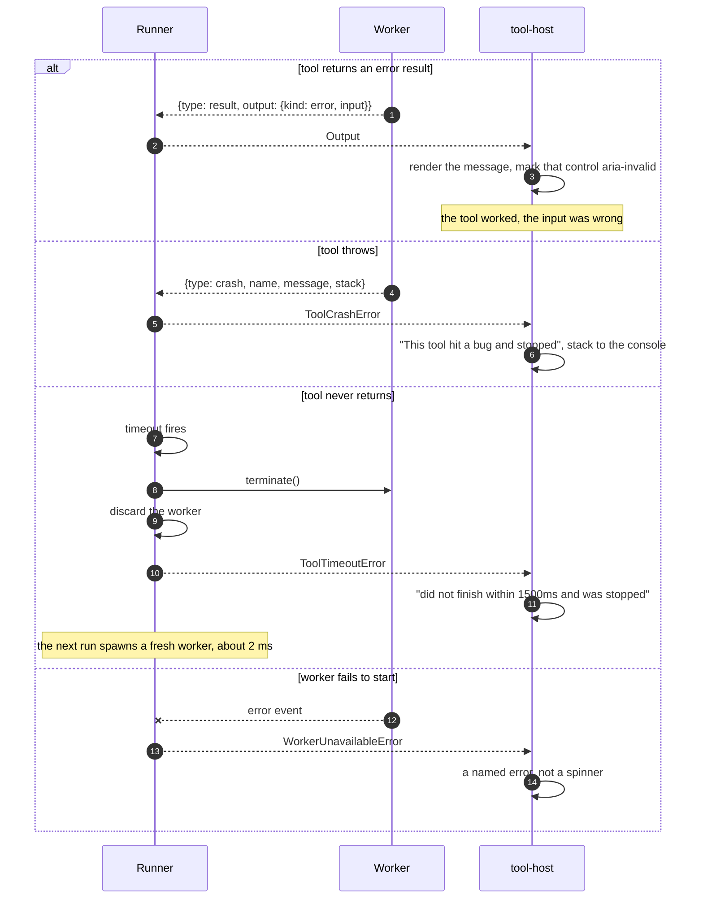
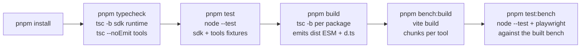

# Architecture

How Toolbench is put together, why the boundaries sit where they do, and what you need to know to
change it.

**Audience.** Anyone working on the packages, reviewing a change, or deciding whether to adopt this.
It assumes you can read TypeScript. It does not assume you have written a custom element, used a Web
Worker, or thought about bundler chunking before; §2 covers the vocabulary.

**Contents**

1. [Scope](#1-scope)
2. [Terminology](#2-terminology)
3. [System overview](#3-system-overview)
4. [Repository layout](#4-repository-layout)
5. [The contract](#5-the-contract)
6. [Components](#6-components)
7. [Control flow](#7-control-flow)
8. [Invariants, and where they are enforced](#8-invariants-and-where-they-are-enforced)
9. [Lifecycle and teardown](#9-lifecycle-and-teardown)
10. [How to change it](#10-how-to-change-it)
11. [Build pipeline](#11-build-pipeline)
12. [Testing strategy](#12-testing-strategy)
13. [Performance budget](#13-performance-budget)
14. [Defect register](#14-defect-register)
15. [Limitations](#15-limitations)
16. [Contributing](#16-contributing)
17. [Appendix](#17-appendix)

---

## 1. Scope

Toolbench does three things:

1. Defines what a **tool** is: a function from named inputs to one of a fixed set of result shapes,
   plus a JSON manifest describing both.
2. Renders a tool in a web page, in one of three presentations, and runs it.
3. Keeps old tools working as the contract grows.

Everything else is out of scope on purpose. There is no editor, no sandbox, no server, no plugin
marketplace, and no dataflow between tools. §15 lists what that costs.

## 2. Terminology

Skip this if the words are familiar.

| Term | What it means here |
|---|---|
| **Tool** | A directory containing `tool.json`, an entry module exporting `{ run }`, fixtures, and help text. |
| **Manifest** | `tool.json`. Identity, inputs, which result shapes the tool can return, and how it should be run. |
| **Contract version** | The integer in `manifest.sdk`. Says which shapes and fields the tool is allowed to use. Not the same as the tool's own `version`, and not the same as the npm package version. |
| **Host** | The website embedding Toolbench. It owns the page, the bundler, and the list of tools. |
| **Custom element** | A browser feature for defining your own HTML tag with behaviour attached. `<tool-host>` is one. Any page can use it; no framework is involved. |
| **Shadow DOM** | A subtree attached to an element whose styles are isolated in both directions: the page's CSS does not apply inside, and the inside CSS does not leak out. The runtime renders into one. |
| **CSS custom property** | A variable like `--tb-accent`. Unlike normal styles, these *do* cross the shadow boundary, which is why theming works by setting them. |
| **Web Worker** | A separate JavaScript thread. It has no DOM access, communicates by message passing, and can be terminated from the outside. That last property is the only reason Toolbench uses one. |
| **Code splitting** | A bundler emitting several JavaScript files instead of one, so a page can download only the parts it uses. Each file is a **chunk**. |
| **Dynamic import** | `import("./x.ts")` as an expression. Returns a promise, and tells the bundler "this is a chunk boundary". |
| **Facade** | A cheap stand-in for something expensive, replaced on demand. A Toolbench card is markup with no behaviour until the reader opens it. |
| **Seed** | A precomputed result embedded in the page, so a card shows something real before any script runs. |
| **Fixture / case** | An entry in `cases.json`: an input and the exact result expected from it. |
| **Type stripping** | Node running a `.ts` file by deleting the type annotations, with no compiler step. Requires that the file contains no syntax that emits code (see §11). |

## 3. System overview

Three phases, and the boundary between them is the thing to hold onto: **the manifest is data and can
move at any time; the tool's code must be present at build time.**



Reading the diagram:

* A **manifest** is validated and migrated before anything sees it, so every component downstream
  deals with current, well-formed data only.
* A **tool's module** reaches the browser through the host's bundler. Nothing fetches code at runtime,
  because doing that on a static site requires `eval`, which costs bundling, tree shaking, and any
  Content-Security-Policy worth having.
* The **worker is optional and per tool.** The runner's interface is identical either way.
* **Results are migrated on the way out**, so a tool written against an older contract renders through
  today's renderers without knowing.

## 4. Repository layout

```
toolbench/
├── packages/
│   ├── sdk/                        @toolbench/sdk   no dependencies, no DOM
│   │   └── src/
│   │       ├── types.ts            the contract: Output, InputSpec, Manifest, Ctx, Tool
│   │       ├── validate.ts         manifest validation and the cross-field invariants
│   │       ├── migrate.ts          version migration chain
│   │       ├── seed.ts             build-time seeding, and safe serialisation for a script tag
│   │       ├── fixtures.ts         the tool-directory walk. Node-only, exported at ./fixtures
│   │       ├── testing.ts          fixture runner and result comparison
│   │       ├── version.ts          SDK_VERSION, supported versions, changelog
│   │       └── index.ts            public surface
│   └── runtime/                    @toolbench/runtime   no dependencies, no framework
│       └── src/
│           ├── element.ts          <tool-host>: modes, form, states, accessibility
│           ├── runner.ts           execution: sequencing, abort, timeout, progress
│           ├── worker.ts           createToolWorker, the worker side of the protocol
│           ├── protocol.ts         message types and error classes
│           ├── sources.ts          ToolSource interface, RegistrySource
│           ├── styles.ts           the shadow stylesheet and the theming surface
│           ├── dom.ts              three element helpers, so no framework is needed
│           ├── render/index.ts     renderer dispatch, fields, table, text, code, error, group
│           ├── render/chart.ts     the series renderer, SVG plus a data table
│           ├── register.ts         side-effecting entry for pages without a bundler
│           └── index.ts            public surface
├── tools/
│   ├── cases.test.ts               runs every tool's manifest and fixtures
│   ├── tsconfig.json               tools compile with no DOM and no path aliases
│   ├── percentiles/                pure, main thread, group of fields and table
│   └── queue-explorer/             pure, worker, group of series and fields, plus convergence tests
├── bench/
│   ├── index.html                  card mode, theming, failure modes
│   ├── tool.html                   page mode
│   ├── article.html                embed mode, two tools in prose
│   ├── bench.test.ts               the runtime driven by Chrome against the built bench
│   ├── fixtures/stress/            a tool that misbehaves on purpose
│   └── src/                        registry, boot, worker entry, page scripts
├── docs/                           this file, authoring, versioning
└── .github/workflows/ci.yml        typecheck, tests, build, browser tests
```

## 5. The contract

`packages/sdk/src/types.ts` is the whole agreement between a tool author and a host. It is worth
reading in full; this is the shape of it.

### 5.1 A tool

```ts
export interface Tool<I extends InputValues = InputValues> {
  run(input: I, ctx: Ctx): Output | Promise<Output>;
}

export interface Ctx {
  signal: AbortSignal;
  progress(fraction: number, partial?: Output): void;
}
```

Three rules follow, and they are not stylistic:

1. **`run` must not touch the DOM.** It has to work in Node (fixtures), in a worker (no DOM exists),
   and during a host's build (seeding). Any one of those would force it.
2. **`run` must be a function of its inputs.** No clock, no unseeded randomness, no I/O. That is what
   makes a fixture meaningful.
3. **A loop whose length depends on an input must check `ctx.signal`**, and the tool should declare
   `thread: "worker"` so a timeout can stop it.

### 5.2 Results

```ts
export type Output =
  | { kind: "fields";   fields: Field[] }
  | { kind: "text";     text: string; mono?: boolean }
  | { kind: "code";     lang: string; source: string }
  | { kind: "table";    columns: Column[]; rows: Cell[][]; caption?: string }
  | { kind: "series";   chart: Chart }
  | { kind: "group";    parts: Output[] }
  | { kind: "bytes";    bytes: number[]; offset?: number; highlight?: ByteRange[]; caption?: string }
  | { kind: "error";    message: string; input?: string; at?: number; len?: number };
```

The union is closed. A tool cannot invent a shape nobody can draw, and the runtime can promise to draw
anything a tool returns. Two members carry more weight than the rest:

* **`group`** is how one tool answers in several shapes. A decoder returning header fields *and* a
  table of records is the normal case, not an exception. Without it, tools would either lose half their
  output or the contract would need a second result channel.
* **`error`** means the input was wrong and the tool behaved correctly. `input` names the offending
  control, which is what lets a generated form mark it invalid and point a screen reader at the
  message. Without that field, an error can only float unattached. A tool with a genuine bug should
  **throw** instead; §7.5 shows how the two render differently.

### 5.3 Inputs

```ts
export type InputSpec =
  | (InputBase & { type: "text";     default: string; maxLength?: number })
  | (InputBase & { type: "textarea"; default: string; rows?: number; maxLength?: number })
  | (InputBase & { type: "number";   default: number; min: number; max: number; step?: number })
  | (InputBase & { type: "select";   default: string; options: { value: string; label: string }[] })
  | (InputBase & { type: "toggle";   default: boolean });

interface InputBase {
  id: string;
  label: string;
  description?: string;   // becomes aria-describedby, not a placeholder
  unit?: string;          // "ms", "req/s". A number without one is a riddle
  primary?: boolean;      // the single input a card shows
  dir?: "ltr" | "auto";   // bytes and code stay left to right inside right-to-left prose
}
```

`min` and `max` are required on a number input rather than optional. They are the only thing standing
between a bounded computation and an unbounded one, and the element clamps to them before the tool
sees the value.

### 5.4 The manifest

The fields, and who reads each one:

| Field | Read by | Notes |
|---|---|---|
| `sdk` | migrate, validate | Contract version. Refused if newer than the runtime. |
| `id` | source, element, host routing | Lowercase, hyphenated. Must equal the directory name. |
| `name`, `blurb` | element, host head tags | `blurb` is capped at 200 characters so it works as a meta description. |
| `version` | humans | The tool's own version. Nothing branches on it. |
| `capabilities` | validate, element | `["pure"]` is the only value so far. |
| `runtime.entry` | host bundler, fixture runner | Path relative to the tool directory. |
| `runtime.thread` | runner | `"main"` (default) or `"worker"`. |
| `inputs` | element (form), fixture runner (defaults) | |
| `samples` | validate, element (the row under the form), fixture runner | Labelled example inputs, each `input` partial. Never drawn on a card. |
| `kinds` | validate, fixture runner, host | Every kind `run` can return. Must include `"error"`. |
| `card` | element | `"live"`, `"info"`, `"none"`. |
| `cardFields` | renderers | How many fields a compact result shows. |
| `autoRun` | element | Run as the reader types. Off by default. |
| `timeoutMs` | runner | Worker mode only. Rejected on the main thread. |
| `help`, `tags`, `links`, `status` | host | Presentation and lifecycle. |

## 6. Components

### 6.1 `@toolbench/sdk`

No dependencies, no DOM, no framework. Four modules that matter.

**`types.ts`** is documentation as much as code; §5 is a summary of it.

**`validate.ts`** turns unknown JSON into a `Manifest` or throws a `ManifestError` naming the field.
Hand written rather than schema-library driven, for one reason: the error messages are the interface a
first-time tool author meets. Compare what a generic validator says with what this says:

```
inputs[0].options: a select needs at least two options; with one, use a fixed value

timeoutMs: is only meaningful with runtime.thread = "worker". On the main thread there
           is nothing to terminate, so a timeout here would be a field that lies.
           Either move the tool to a worker or bound its input.
```

The cross-field invariants at the bottom of the file are the interesting part; §8 lists them.

**`migrate.ts`** holds the migration chain: two steps today, `1 → 2` and `2 → 3`, with every half the
identity function. The machinery was built before anything needed it, and tested with synthetic versions,
which is why the first real entry was a five-line change rather than a design exercise under pressure. It
repaid that twice over: while still synthetic, the tests caught a bug where the chain silently did
nothing, because a helper used the module constant instead of the injected current version.

**`testing.ts`** runs fixtures and compares results. Comparison is exact by default. Subset matching is
opt-in and has to justify itself:

| Rule | Why |
|---|---|
| Exact deep equality by default | Catches a field emitted twice, fields reordered, a field dropped, or garbage returned beside a correct error |
| `match: "subset"` requires `why` | An opt-out of exactness should say what it is for |
| Subset on `fields` requires `fieldCount` | Otherwise a dropped field passes |
| Subset descends into a `group` | Composite results are normal; a case has to be able to reach the part it means |
| Fields are keyed by `group` plus `label` | A tool reporting the same quantity under two headings is normal, and label-only keying reported a duplicate that was not one |
| Subset on `series` compares the chart's frame, not its points | Pinning hundreds of computed numbers in a fixture is unreadable; the numbers belong in a unit test that says why they are right |

### 6.2 `@toolbench/runtime`

**`element.ts`** is `<tool-host>`, and it is the only public surface most hosts touch. It owns:

* reading `tool` and `mode` attributes, and the inline seed;
* deciding when to activate (click for a card, intersection for a page or embed);
* building the form from `manifest.inputs`, including labels, descriptions, bounds and text direction;
* the state machine: facade, loading, idle, running, result, stale, error;
* accessibility: label association, `aria-describedby`, `aria-invalid` driven by `error.input`, a
  `role="status"` region carrying a short summary, focus moved only on an explicit run;
* teardown, which is what stops a worker leaking on client-side navigation.

**`runner.ts`** executes. Its whole job is the difference between "call a function" and "call a
function that might not come back":

| Concern | Mechanism |
|---|---|
| A newer run must win | Every run gets a sequence number; a superseded run is rejected with `AbortError` and its result is dropped |
| Progress must not swamp the frame | Coalesced to one animation frame |
| A late progress frame must not overwrite the result | The guard runs at flush time, not call time (§14) |
| A runaway worker must be stoppable | `setTimeout` plus `worker.terminate()`, then the worker is discarded |
| A worker that fails to start must not hang the UI | An `error` listener on the worker rejects the run |
| A worker-mode tool with no factory | Falls back to the main thread with a warning |

**`worker.ts`** is the worker side. It caches loaded modules per id, keeps one `AbortController` per
in-flight sequence, converts a thrown error into a `crash` message, and swallows its own aborts because
the page already knows about those.

**`protocol.ts`** defines the messages and three error types (`ToolTimeoutError`, `ToolCrashError`,
`WorkerUnavailableError`). It is a separate file because the message shapes are the actual contract
between two threads, and burying them inside the runner made that easy to forget.

**`sources.ts`** defines `ToolSource`:

```ts
export interface ToolSource {
  list(): Promise<Manifest[]>;
  load(id: string): Promise<LoadedTool>;
}
```

`RegistrySource` is the implementation hosts use. It validates and migrates every manifest on
construction, so a malformed tool is a startup error with a field name rather than a mystery at render
time, and it refuses two tools claiming the same id.

**`render/`** holds one function per result kind plus the dispatcher. The dispatcher ends with:

```ts
default: {
  const _exhaustive: never = output;
  return unknownOutput((_exhaustive as { kind: string }).kind);
}
```

Adding a kind to the SDK without adding a renderer is therefore a compile error in this package. The
`unknownOutput` fallback covers the case a compiler cannot: an old runtime meeting a newer tool at
runtime. It renders a message saying the page needs a newer runtime, never a blank space.

**`render/chart.ts`** draws SVG. It has no charting dependency, which is a deliberate trade: a library
would be 40 to 200 KB and would decide how every tool looks. It also emits the chart's numbers as a
`<table>` inside a `<details>`, because a chart is an image and a screen reader gets nothing from it.

**`styles.ts`** is one template string adopted into every shadow root via `adoptedStyleSheets`, so one
parsed stylesheet serves every instance on the page.

### 6.3 What the host owns

Deliberately small, and deliberately not zero:

| Host responsibility | Why it cannot live in the runtime |
|---|---|
| The `ToolSource` | Only the host knows where its tools are and how its bundler resolves them |
| `tool.worker.ts` | A worker must import tool modules, and a bundler can only follow imports it can see in the host's own module graph |
| `pageUrl` | Only the host knows its routing |
| Rendering `help` | Markdown rendering is a host concern, and most hosts already have one |
| Seeding | Requires running a tool during the host's build, which only the host can do. `seed()` and `serialiseSeed()` in the SDK do the work; wiring them into a build is the host's |

## 7. Control flow

### 7.1 Registration and first paint



Nothing has been downloaded except the manifest data, which was already in the page's bundle.

### 7.2 Activation



Two decisions are visible here. The form is not painted until the module has arrived, because a Run
button that exists and does nothing is worse than a spinner. And activation does not run the tool: see
§7.3 for why.

### 7.3 A run on the main thread



The reader triggers every run. An earlier version ran on activation and again on every keystroke, and
the result was a Run button that appeared broken: the answer was already on screen before you looked at
it, and pressing the button changed nothing visible. It also did work nobody asked for. A tool that is
genuinely instant can opt back in with `autoRun`.

### 7.4 A run in a worker



`Ctx` is built on the side that runs the tool, never sent across the boundary. An `AbortSignal` is not
structured-cloneable, `progress` is a function, and a `Response` is neither. Once that is true, an RPC
library adds a wrapper and removes the one thing needed here, which is a timeout that can stop a
running tool, so the protocol is hand written in about forty lines.

### 7.5 Failure paths



Four distinct outcomes, four distinct messages. A reader who cannot tell them apart cannot do anything
useful about any of them, and the failure paths are the part a demo never exercises.

## 8. Invariants, and where they are enforced

Rules the rest of the system relies on. Each is checked once, in one place, and each has a test.

| Invariant | Enforced in | If it were not |
|---|---|---|
| `manifest.sdk` is a version this SDK can read | `migrate.ts`, `validate.ts` | A tool from the future renders half correctly |
| `id` matches `^[a-z0-9][a-z0-9-]*$` and equals the directory name | `validate.ts`, `tools/cases.test.ts` | Derived links and routes point at the wrong tool |
| No two tools share an `id` | `RegistrySource` constructor | One silently shadows the other |
| Input ids are unique; at most one is `primary` | `validate.ts` | A card would have to guess which input to show |
| A number input declares `min` and `max` | `validate.ts` | An unbounded input turns a bounded computation into a hang |
| A select has two or more options and its default is one of them | `validate.ts` | A control with one choice, or none selected |
| `kinds` includes `"error"` | `validate.ts` | A tool with no way to reject bad input |
| Every case's `expect.kind` is declared in `kinds` | `tools/cases.test.ts` | `kinds` drifts into fiction |
| Every sample fills declared inputs only, with values of the right type inside their bounds, and no two share a label | `validate.ts` | A button that fills the form with a value the form itself refuses |
| Every declared sample runs without throwing | `tools/cases.test.ts` | The first thing a reader clicks is the first thing to crash |
| Only a `pure` tool with no assets may be `card: "live"` | `validate.ts` | A landing page card could read files or call the network |
| `timeoutMs` requires `thread: "worker"` | `validate.ts` | A field that cannot do what it says |
| `autoRun` is refused on a worker-mode tool | `validate.ts` | Keystroke-triggered runs of the slowest tools |
| Every `Output` kind has a renderer | `render/index.ts` exhaustive switch | A blank space in front of a reader |
| A superseded run cannot render | sequence numbers in `runner.ts` | The older, slower answer wins |
| A tool's fixtures pass against the current runtime | `tools/cases.test.ts` in CI | "Old tools keep working" becomes an intention |

## 9. Lifecycle and teardown

```
connectedCallback
  └─ read seed, list manifests, paint facade
       └─ (card) click  ──┐
       └─ (page)  observe ┴─ activate
                             └─ load module, create Runner, paint form
                                  └─ run, run, run ...
disconnectedCallback
  └─ runner.dispose()   cancel in flight, terminate the worker
  └─ observer.disconnect()
  └─ clear the debounce and slow-run timers
```

Teardown matters more than it looks. On a site with client-side navigation the element is removed
rather than the page being reloaded, so a worker with no owner survives. Each one holds a few megabytes.
Nothing else in the system will clean it up, which is why `disconnectedCallback` is not optional and
why a host should never create a worker outside the element's lifetime.

## 10. How to change it

### 10.1 Add a result kind

This is a contract change, so it is also a version bump. Read [versioning.md](versioning.md) first.

1. `packages/sdk/src/types.ts`: add the member to `Output` and to `OUTPUT_KINDS`. Define any new
   supporting interfaces in the same file.
2. `packages/sdk/src/version.ts`: bump `SDK_VERSION`, append to `SUPPORTED_SDK_VERSIONS`, add a
   `SDK_CHANGELOG` line.
3. `packages/sdk/src/migrate.ts`: add the `Migration` for the boundary you just created. Both halves
   are normally the identity function; if they are not, the change was not additive.
4. `packages/runtime/src/render/`: add the renderer. The exhaustive switch will not compile until you
   do, which is the intended pressure.
5. `packages/runtime/src/styles.ts`: styles for it, using the existing custom properties.
6. A tool or a fixture that exercises it, and `pnpm check`. Every existing tool's fixtures must pass
   without being edited.

### 10.2 Add an input type

1. `types.ts`: add the variant to `InputSpec` and to `INPUT_TYPES`.
2. `validate.ts`: validate its fields, including whatever bound keeps it from being unbounded.
3. `element.ts`: add a `case` to `#control`. Everything there is per type: the control, its
   `aria-describedby`, the keyboard behaviour, and what a change does.
4. `styles.ts`, then a fixture and a bench entry.

Also a version bump.

### 10.3 Add a capability

Contract version 1 has only `pure`. A capability is a promise about what a tool will try to do, so
adding one means deciding three things before writing code:

* what the runtime **injects** for it (`ctx.fetch`, `ctx.asset`, a file handle);
* what the runtime **refuses** without it, and where that refusal is enforced;
* whether a tool holding it may still be a live card. For anything touching files or the network the
  answer is no, and `validate.ts` is where that is written down.

### 10.4 Add a `ToolSource`

Implement two methods. The only rule is the one in §3: `list()` may do anything, including a network
request, but `load()` must resolve to a module the bundler has already seen. A source backed by a
remote repository works by generating a registry at build time, not by fetching JavaScript in the
reader's browser.

### 10.5 Add a display mode

`Mode` in `element.ts`, plus the branch in `#paint` and the activation policy in `#prepare`. Before
adding one, check whether an existing mode plus host CSS gets there; three modes already cover compact,
full and in-prose, and a fourth needs a reason beyond looking different.

## 11. Build pipeline

### 11.1 What runs



Each step is also a script you can run alone. `pnpm check` is steps 2 and 3, which is what to run while
working.

### 11.2 Compiler settings that are load bearing

From `tsconfig.base.json`:

| Option | Why it is on |
|---|---|
| `erasableSyntaxOnly` | Rejects `enum`, `namespace`, decorators and constructor parameter properties: anything that emits code. Node runs tools and tests by stripping types, so a file using those would work through a bundler and fail in Node. The compiler makes that impossible instead of surprising. |
| `allowImportingTsExtensions` plus `rewriteRelativeImportExtensions` | Source imports `./x.ts`, which is what Node needs; the emitted JavaScript says `./x.js`, which is what a published package needs. Without both you have to choose one. |
| `verbatimModuleSyntax` | Type-only imports are erased exactly as written, so a tool importing only types has no runtime dependency on the SDK at all. |
| `exactOptionalPropertyTypes` | `{ a?: string }` and `{ a: string \| undefined }` stop being interchangeable. Verbose, and it caught real mistakes in the optional manifest fields. |
| `noUncheckedIndexedAccess` | `array[i]` is `T \| undefined`. The chart renderer is full of index arithmetic; this is where it belongs. |
| `composite` on both packages | Project references, so `runtime` typechecks against `sdk`'s emitted declarations rather than its source. |

`tools/tsconfig.json` is separate on purpose: `lib` is ES2023 with no DOM, so a tool cannot reach for
`document` by accident, and there are no path aliases, because Node's type stripping does not resolve
them.

### 11.3 Bundling, and two traps

The bench uses Vite. Two settings are not optional for anyone doing the same thing:

```ts
// bench/vite.config.ts
worker: { format: "es" },              // the default, "iife", cannot code-split
build: {
  rollupOptions: {
    output: {
      manualChunks(id) {
        const m = /\/(?:tools|fixtures)\/([^/]+)\/index\.ts$/.exec(id);
        return m ? `tool-${m[1]}` : null;
      },
    },
  },
},
```

* **`worker.format`** defaults to `"iife"`. A worker that dynamically imports anything then builds fine
  in development and fails the production build with "UMD and IIFE output formats are not supported for
  code-splitting builds".
* **`manualChunks`** exists because every tool's entry file is named `index.ts`, so without it every
  chunk is called `index-<hash>.js`. That makes the network panel useless for the one thing the bench
  demonstrates, and it made a test count the page's own entry as a tool chunk.
* **`worker.rollupOptions` needs the same treatment**, separately, because none of `build.rollupOptions`
  applies to the worker's build. Skipping it leaves the worker's copies anonymous, which is how a
  duplicate copy of every tool went unnoticed for a while.

### 11.4 Artifacts

| Command | Output |
|---|---|
| `pnpm build` | `packages/*/dist`: ESM plus `.d.ts` and source maps. No bundling; consumers bundle. |
| `pnpm bench:build` | `bench/dist`: three HTML entries, one CSS file, one runtime chunk, one chunk per tool, one worker chunk. |

### 11.5 CI

`.github/workflows/ci.yml`, on push to `main` and on every pull request: install with a frozen
lockfile, typecheck, test, build, build the bench, install Chromium, run the browser tests. The step
that matters most is `pnpm test`, because it runs **every** tool's fixtures against the current SDK and
runtime. That is the mechanism behind the compatibility promise, not a nicety.

## 12. Testing strategy

Four layers. Each catches something the others structurally cannot.

| Layer | Where it runs | What it covers | Count |
|---|---|---|---|
| `packages/sdk/src/*.test.ts` | Node | Manifest validation and every invariant, the migration chain both synthetically and against the real `1 → 3` steps, seeding, the tool-directory harness's failure modes, and fixture comparison including its guard rails | 79 |
| `tools/cases.test.ts` | Node | Every tool's manifest, that `id` matches its directory, that fixtures exist and are non-empty, that declared `kinds` match the cases, every case, and every sample. Three lines calling `checkToolDirectory`, so it is the same suite a host gets | 13 |
| `tools/*/‌*.test.ts` | Node | A tool's own properties. The queue explorer asserts that its simulation converges on the closed form, that it is deterministic, and that Little's law holds | 7 |
| `bench/bench.test.ts` | Chrome, against the **built** bench | Everything a unit test cannot see | 24 |

The browser layer is weighted towards things that only exist in a browser or only appear in a
production build:

* a card fetches no tool chunk until it is opened, and exactly one when it is;
* a seeded card shows a real result before anything runs;
* activation does not run the tool, and the status says "press Run";
* changing an input marks the result stale without re-running, and Run clears it;
* a sample fills the form, sets several inputs at once, leaves the ones it does not name alone, keeps
  focus on the button that was pressed, and draws no row on a card;
* all three modes, including two tools in one article with different threading;
* a tool that spins forever is killed by the timeout, the page stays responsive, and the next run gets a
  fresh worker;
* a crash reads differently from bad input, and bad input marks the right control invalid;
* labels, `aria-describedby` targets that exist, the status region, bounded number inputs;
* theming through custom properties only.

Two habits worth keeping. **Test against the built artifact**, because a minifier deleted a loop that
made a timeout test pass for the wrong reason (§14). And **assert an allowlist rather than a denylist**
when checking what loaded, because a denylist only catches the leaks you predicted.

## 13. Performance budget

Measured with gzip on `bench/dist`, not estimated. Reproduce with `pnpm bench:build && node
scripts/size-check.mjs`, which is also a CI step: every figure below has a budget, so a number in this
table cannot quietly stop being true.

| Item | Transfer | Notes |
|---|---|---|
| Runtime plus the bench's own wiring | 18.9 KB | One chunk, once per page that uses a tool. Grew 1.5 KB with contract v2's bytes renderer, and 0.9 KB with contract v3's sample row |
| Stylesheet | 0.9 KB | |
| Worker entry | 3.3 KB | Only on pages with a worker-mode tool, and only after activation |
| `percentiles` chunk | 1.2 KB | |
| `queue-explorer` chunk | 1.2 KB | |
| A page with no tool | 0 bytes | Nothing is imported |
| A card nobody opens | 0 bytes of tool code | The facade is markup |

Where the budget is spent: about half the runtime chunk is the chart renderer and the stylesheet. If
that becomes a problem the chart is the obvious thing to split into its own lazily-imported chunk, since
most tools never draw one.

That chunk now measures 18,925 bytes against a 19,000 byte ceiling, so the next thing that costs real
bytes either buys them explicitly, by raising the budget in the commit that spends it and moving this
table with it, or takes the chart split above.

**One duplication to know about.** Vite builds a worker in a separate Rollup pass, so every tool
reachable from the worker is emitted twice: `tool-<id>` for the main thread and `worker-tool-<id>` for
the worker. A reader downloads one of the two, because a tool declares one thread, so the cost is deploy
bytes rather than transfer bytes. It is named rather than hidden: before those names existed both copies
were called `index-*.js`, and the second copy was invisible.

## 14. Defect register

Every entry is a real defect found while building this, and the guard that now stops it recurring. It
is here because the guards look arbitrary without it.

| Defect | How it appeared | Guard |
|---|---|---|
| Worker-mode tools were downloaded twice by the reader | The element called `source.load()` for every tool, but in worker mode the runner only ever reads `loaded.manifest`. So the main thread fetched and parsed a module it never called, doubling what a worker-mode tool costs | `Runner` takes a `Runnable` whose `tool` is optional, and the element loads the module only when this thread will call it. A browser test asserts which of the two chunks is fetched, and that neither loads under an anonymous name |
| The worker's copies of every tool were called `index-*.js` | The duplication above was invisible in the network panel, and a chunk-name assertion could not see it | `worker.rollupOptions.output.manualChunks` names them `worker-tool-<id>`, so the panel says which thread ran |
| Every two and three-byte highlight in a hex dump was invisible | Only the one range carrying a different tone showed at all. The `normal` tone used `--tb-accent-bg`, a wash that is nearly the surface colour, while the code comment beside it said two hex digits are too small a target to read a colour from | A solid `--tb-accent`. Browser test asserts a marked byte has a non-transparent background |
| A hex dump's ASCII gutter drifted left on the final row | Each row was its own CSS grid, so column widths were computed per row and a short last row sized its own hex column | One grid for the dump, rows as `display: contents`. Browser test compares the gutters' x positions across rows |
| The status region announced "4 fields, 19 bytes, 4 fields marked" | Two counts of "fields" meaning different things, neither wrong alone | Ranges are called ranges. Browser test asserts the string does not contain "fields marked" |
| A stale dev server made a new tool look unregistered | `import.meta.glob` resolves at transform time, so a server started before the tool directory existed reported "No tool with id ...". Without `strictPort` the new server had quietly moved to another port | `strictPort` on the bench's dev and preview scripts, so a taken port fails loudly instead of succeeding on the wrong one |
| A throttled progress frame landed after the final result and overwrote it | The chart appeared for one frame and vanished. Status said "chart, 2 series" while the screen showed the partial fields | The staleness check runs at animation-frame flush time, not at call time. Browser test asserts the chart survives a second after settling |
| Series colour classes set `stroke` and `fill` together | Equal specificity, later in the sheet, so they beat `fill: none` and every line drew as a filled blob | One custom property per series; the shape decides whether it is a stroke or a fill |
| The form was painted before the tool's module arrived | Run existed and did nothing. Invisible locally, a dead control on a slow connection | `#loading` keeps the facade up until the module lands. Browser test asserts the status is "press Run" only once the form exists |
| Ran on activation and on every keystroke | The Run button looked broken because the answer was already there | Run is the only trigger; `autoRun` is opt-in and refused for worker tools |
| The progress bar was always visible | Flashed for 20 ms on fast runs: motion reporting that nothing had happened | Revealed only after 400 ms |
| Subset fixture matching could not see inside a `group`, and keyed fields by label alone | A tool reporting one quantity under two headings tripped a duplicate check that was not one | Subset descends into groups; fields keyed by `group` plus `label` |
| The minifier deleted an empty timing loop as dead code | The stress tool returned instantly, so the timeout test passed for the wrong reason | The loop does work whose result is returned. Browser tests run against the built bundle |
| Vite's default `worker.format` cannot code-split | Worker mode built in development and failed the production build | `worker: { format: "es" }`, documented in the README and here |
| A backtick inside a CSS comment | Terminated the stylesheet's template literal; the error pointed at a line 40 away | An assertion in the edit script, and a note in the file |
| `chainFrom` used the module constant instead of the injected version | Migration chains silently did nothing | Migration tests inject synthetic versions and assert the steps ran, in order |
| A sample could push a tool past its own `maxLength` | The field was declared on text inputs and enforced nowhere. It reaches the browser as the `maxlength` attribute, which constrains typing and nothing else, and filling a control from a sample assigns the value directly and walks straight past it, so the tool would have run on more characters than it declared it accepts | `validate.ts` rejects an over-long sample string, for the same reason it rejects an out-of-range sample number. A reader's typing still clamps: static data an author wrote can be a build error, a keystroke has nowhere else to go |
| The additive-migration check accepted a step that rewrote an existing field | The probe fed each step a two-key manifest, so a step quietly rewriting anything outside those two keys still looked like the identity function. Confirmed by mutating the `2 → 3` step to rewrite `help`, which the old probe passed | The probe passes a whole manifest, stamped with the version of the step under test, and compares the entire key set. An allowlist rather than a denylist: asserting one key name was absent let a step inventing a misspelling of it through |

## 15. Limitations

Known and accepted, with what each costs.

* **The contract is pure functions only**, at version 3. No file input, no network. A converter or an
  API client needs version 4 or 5. Both real version bumps so far have held the policy: every migration
  half is the identity function, and no existing tool's fixtures changed for either.
* **No sandbox.** A tool runs with the page's privileges. Worker mode isolates the *thread*, not the
  origin: it shares cookies and does not inherit the page's Content-Security-Policy. Fine for code you
  wrote; not fine for code you did not.
* **No syntax highlighting for `code` results.** The `data-lang` attribute is a hook for a host that
  already has a highlighter. Bundling one would double the runtime.
* **The chart is deliberately simple.** No tooltips, no zoom, no time axis. It draws what `Chart`
  describes.
* **`RegistrySource` is eager about manifests.** Every manifest is parsed and validated at startup.
  That is milliseconds for tens of tools and would need revisiting at hundreds.
* **No `series` renderer split.** See §13.
* **Node 24 or newer for development.** Tools and tests run as TypeScript with no build step, which is
  worth the floor.

## 16. Contributing

### 16.1 Getting set up

```sh
git clone <this repository>
cd toolbench
pnpm install
pnpm check      # should be green before you change anything
pnpm bench      # http://localhost:5180
```

### 16.2 The loop

1. `pnpm check` while working. It is typecheck plus every Node test, and it takes about a second.
2. `pnpm bench` and look at the thing. Every visual defect in §14 was found by looking, not by
   reasoning.
3. `pnpm bench:build && pnpm test:bench` before opening a pull request. The browser tests run against
   the built bundle, and that difference has caught real bugs.

### 16.3 Standards

* **Every behaviour change needs a test in the layer that can see it.** A rendering change belongs in
  the browser suite; a contract change belongs in the SDK suite.
* **Comments explain why, not what.** If a line looks arbitrary, say what went wrong without it. The
  `⚠️` marker is for a trap someone could reasonably fall into again.
* **No new dependencies in `packages/`** without saying in the pull request what it buys and what it
  costs in transfer size. Both packages have zero dependencies today, and that is a feature.
* **Accessibility is part of the change, not a follow-up.** A new input type needs its label, its
  description target and its keyboard behaviour in the same commit.
* **Additive changes only, for anything in the contract.** See [versioning.md](versioning.md).

### 16.4 Pull request checklist

- [ ] `pnpm check` passes
- [ ] `pnpm bench:build && pnpm test:bench` passes
- [ ] Every existing tool's fixtures pass **without being edited**. If one needed editing, explain why
      the change is not a breaking one
- [ ] New behaviour has a test in the right layer
- [ ] Contract change: version bumped, migration added, changelog line written
- [ ] Public API change: README and the relevant doc updated in the same commit
- [ ] Transfer size checked if `packages/runtime` grew: `pnpm bench:build`, then gzip
      `bench/dist/assets/boot-*.js`

### 16.5 Commit messages

A subject line that says what changed, then a body that says why, in prose. If the change came from a
defect, describe the defect concretely: what was on screen, what should have been. Those descriptions
are what §14 is built from, and they are the most useful thing in the history six months later.

### 16.6 Releasing

Both packages are versioned together, because the runtime's renderers and the SDK's types are two
halves of one contract. Publishing is `pnpm build` then `pnpm publish` per package. The contract version
in `version.ts` moves independently, and much more slowly, than the package version.

## 17. Appendix

### 17.1 Worker message reference

Page to worker:

| Message | When |
|---|---|
| `{ type: "run", seq, id, input, sdk }` | A run starts |
| `{ type: "abort", seq }` | The page cancels or supersedes a run |

Worker to page:

| Message | When |
|---|---|
| `{ type: "ready" }` | Once, after the worker's listeners are attached |
| `{ type: "progress", seq, fraction, partial? }` | The tool called `ctx.progress` |
| `{ type: "result", seq, output }` | The tool returned |
| `{ type: "crash", seq, name, message, stack? }` | The tool threw, or its module failed to load |

Aborts are not acknowledged. The page already knows, and the worker's own abort is swallowed rather
than reported as a crash.

### 17.2 Theming reference

Set any of these on `tool-host`. Every one has a light fallback followed by a `light-dark()`
declaration, so browsers without that function get the light palette rather than nothing.

| Property | Default (light) | Used for |
|---|---|---|
| `--tb-bg` | `#ffffff` | The tool's surface |
| `--tb-fg` | `#1a1c22` | Body text |
| `--tb-muted` | `#5c6270` | Labels, secondary text |
| `--tb-faint` | `#767d8c` | Descriptions, axis ticks, status |
| `--tb-border` | `#e2e5ea` | Hairlines and control borders |
| `--tb-surface` | `#f7f8fa` | Input backgrounds, preformatted blocks |
| `--tb-accent` | `#8a5a00` | The Run button, links, annotations |
| `--tb-bad`, `--tb-warn`, `--tb-good` | `#a3242c`, `#8a5a00`, `#1c6b3c` | Result tones and errors |
| `--tb-s1` to `--tb-s6` | see `styles.ts` | Chart series |
| `--tb-radius` | `10px` | Corner radius |
| `--tb-font`, `--tb-mono` | system stacks | Type |
| `--tb-gap` | `0.75rem` | Vertical rhythm inside the tool |

### 17.3 Public API index

`@toolbench/sdk`

| Export | Kind |
|---|---|
| `Tool`, `Ctx`, `Output`, `Field`, `Column`, `Cell`, `ByteRange`, `Chart`, `Series`, `InputSpec`, `InputValues`, `Manifest`, `LoadedTool`, `ToolModule`, `Case`, `Tone`, `Capability`, `OutputKind`, `InputType` | types |
| `OUTPUT_KINDS`, `INPUT_TYPES`, `CAPABILITIES` | constants |
| `validateManifest`, `ManifestError`, `describeSdkVersion` | validation |
| `upgradeManifest`, `upgradeOutput`, `canLoad`, `MIGRATIONS`, `Migration`, `VersionError` | versioning |
| `runCases`, `assertCases`, `compare`, `testCtx`, `CaseResult`, `RunCasesOptions` | fixtures |
| `checkToolDirectory`, `readToolDirectory`, `readTool`, `scanToolDirectory`, `ToolOnDisk`, `ToolDirectoryError` | **`@toolbench/sdk/fixtures`** subpath. Node-only: it reads the filesystem, which is why it is not in the main entry |
| `seed`, `serialiseSeed`, `defaultInputs`, `SeedError`, `SeedOptions` | build-time seeding |
| `SDK_VERSION`, `SUPPORTED_SDK_VERSIONS`, `SDK_CHANGELOG` | version |

`@toolbench/runtime`

| Export | Kind |
|---|---|
| `defineToolHost`, `ToolHost`, `ToolHostConfig`, `Mode` | the element |
| `RegistrySource`, `ToolSource`, `RegistryEntry`, `ToolNotFoundError` | sources |
| `Runner`, `RunHooks`, `RunnerOptions`, `isSuperseded` | execution |
| `ToolTimeoutError`, `ToolCrashError`, `WorkerUnavailableError`, `Request`, `Response` | protocol |
| `render`, `unknownOutput`, `RenderOptions` | renderers, for a host doing its own layout |
| `STYLES`, `applyStyles` | styling |
| `createToolWorker` (from `@toolbench/runtime/worker`) | the worker entry |
